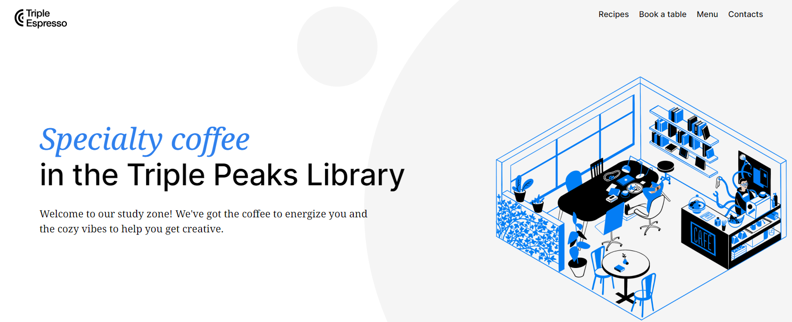
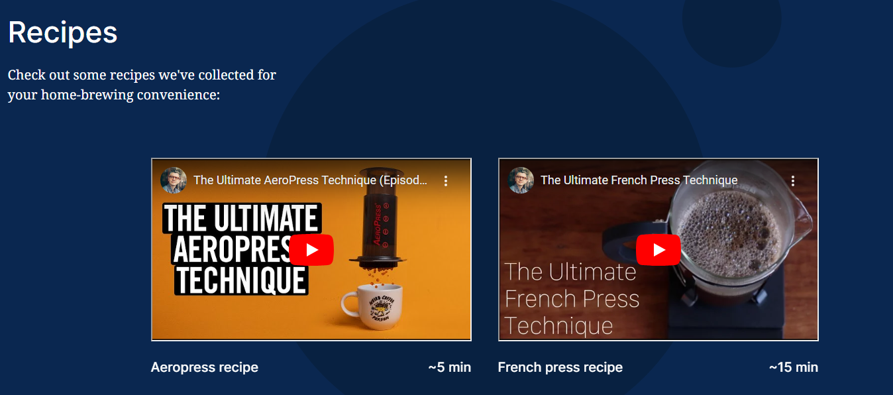
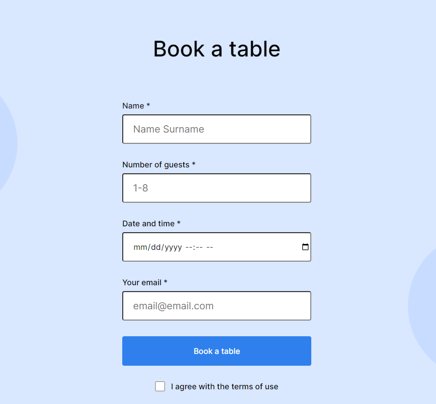

# Triple Peaks Coffee Shop

This is the second project of the Software Engineering program at TripleTen. It was created using HTML and CSS, based on the design brief. This website is for the Triple Peaks Coffee shop located within the Triple Peaks Library.

## Project features

- Semantic HTML5
- Flexbox
- Positioning
- Flat BEM file structure
- A custom form
- CSS animation and transform

## Plan on improving the project

This project was limited to a webpage of 1440 px. To improve upon this, the next step would be optimizing for a mobile device with media queries.

## Sneak Peek

